# CloudNativeSuperpowersUsingOrleans-DotNetAssemble-2026
Cloud-Native Superpowers with Microsoft Orleans - .NET Assembly! 2026

## Presentation slides

### Slide 1 - Title and Session Theme

> **TL;DR:** We are learning how Microsoft Orleans gives cloud-native applications super powers.

This presentation starts with the main theme: Cloud-Native Superpowers with Microsoft Orleans, presented by Johnny Hooyberghs. The goal is to stay practical and focus on building distributed, resilient applications with Orleans on .NET and Azure.

### Slide 2 - About the Speaker
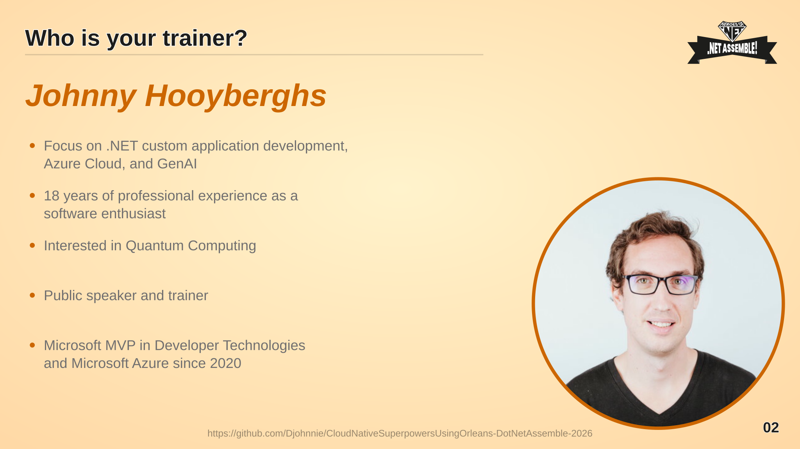

> **TL;DR:** You are learning from hands-on experience in .NET, Azure, and GenAI.

This part introduces who is guiding the session: Johnny Hooyberghs, a Microsoft MVP focused on .NET application development, Azure Cloud, and GenAI. He brings 18 years of professional experience as a software enthusiast, works as a public speaker and trainer, and has a growing interest in Quantum Computing.

### Slide 3 - Presentation downloads
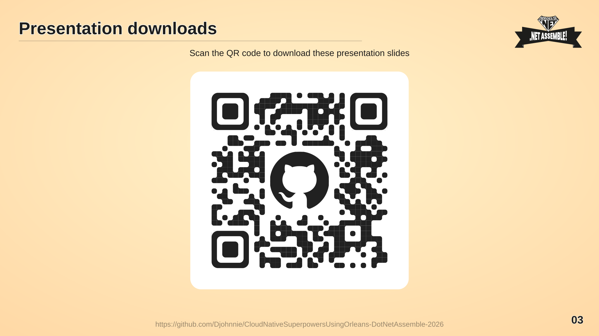

> **TL;DR:** Scan the QR code to download these presentation slides.

This slide gives you a quick way to grab the presentation slides up front, so you can follow along and revisit the material during and after the session.

### Slide 4 - CSharpWars
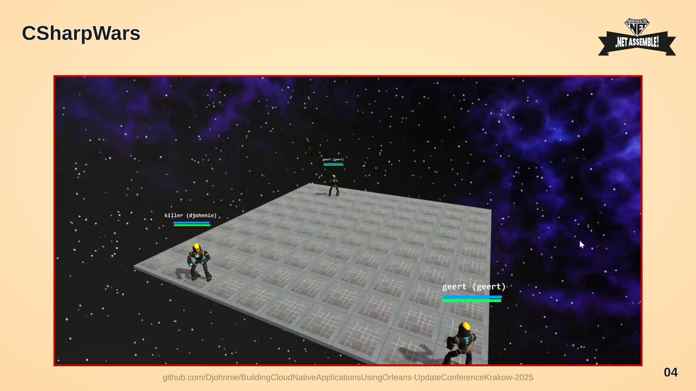

> **TL;DR:** You are seeing the original CSharpWars architecture before Orleans.

This slide shows the CSharpWars architecture that inspired the Orleans examples, with the original system components connected through its shared backend.

### Slide 5 - CSharpWars: Game Loop
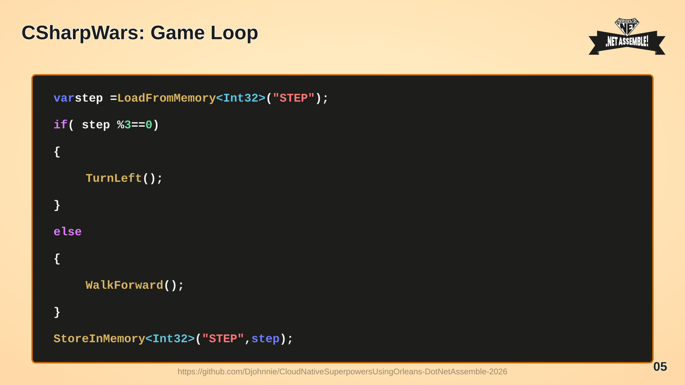

> **TL;DR:** You are seeing the turn-based game loop that drove CSharpWars movement.

This code loads a step counter, turns left every third step, walks forward otherwise, increments the counter, and stores it back in memory. The slide keeps the code as selectable SVG text rather than a raster image.
### Slide 6 - CSharpWars: Original Architecture
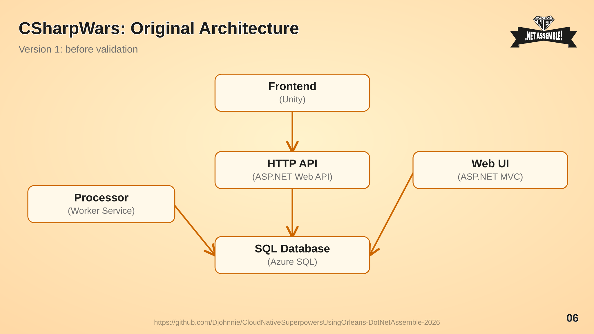

> **TL;DR:** You are seeing how the original CSharpWars services shared a SQL database.

The Unity frontend calls an HTTP API, while the API, background processor and MVC web UI all use Azure SQL. This diagram is adapted from the [original CSharpWars architecture](https://github.com/Djohnnie/BuildingCloudNativeApplicationsUsingOrleans-UpdateConferenceKrakow-2025/blob/main/_slides/06.jpg).

### Slide 7 - CSharpWars: Add a Validator
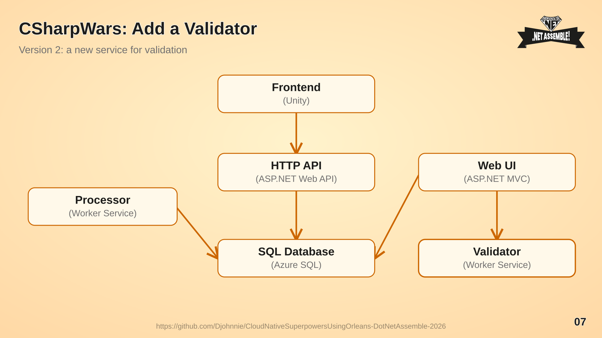

> **TL;DR:** We are watching the architecture grow when validation needs its own worker service.

The original components and their connections remain, but the web UI now also calls a validator. Compare this with the [CSharpWars architecture with a validator](https://github.com/Djohnnie/BuildingCloudNativeApplicationsUsingOrleans-UpdateConferenceKrakow-2025/blob/main/_slides/05.jpg).

### Slide 8 - What is Orleans?
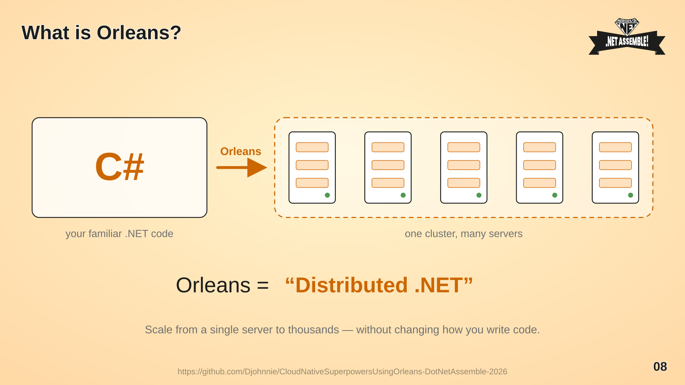

> **TL;DR:** You are learning that Orleans is simply "Distributed .NET".

This slide introduces Orleans as a cross-platform framework that takes the C# you already write and spreads it across many servers. It hides the complexity of distributed systems behind familiar concepts, so the same application can run on a single machine or on a cluster of thousands without changing the way you write code.

### Slide 9 - What Orleans Gives You
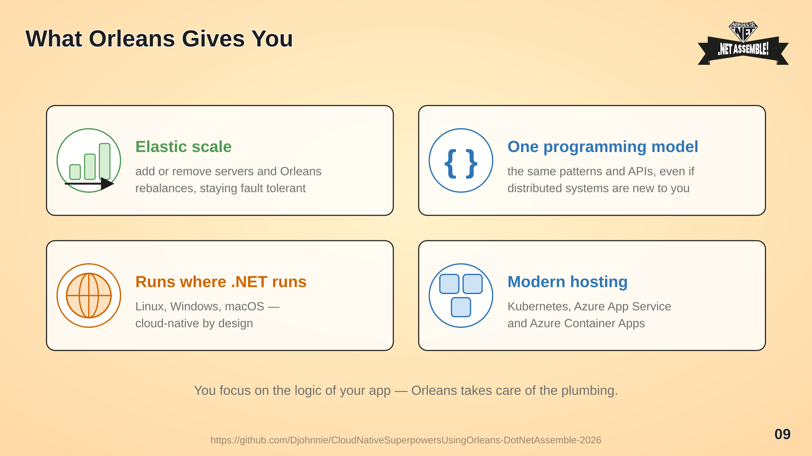

> **TL;DR:** We are looking at the four things Orleans brings to the table.

This part summarises what you get: elastic scale, where adding or removing servers keeps the system fault tolerant; one programming model of shared patterns and APIs, even if distributed systems are new to you; portability to every platform .NET supports; and modern hosting on Kubernetes, Azure App Service or Azure Container Apps.

### Slide 10 - Virtual Actor Model
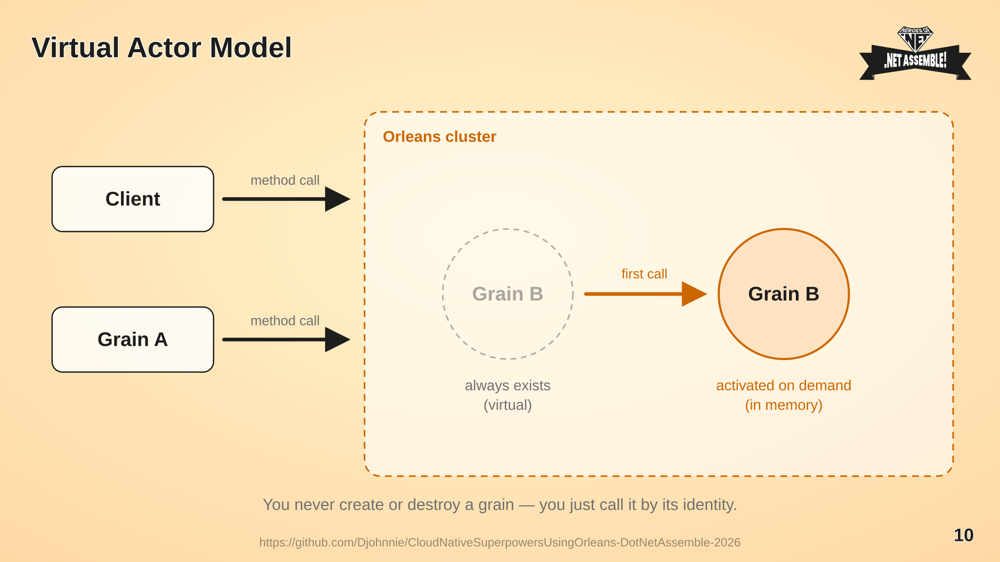

> **TL;DR:** You are learning that a grain always exists and that Orleans activates it the moment you call it.

This slide introduces the virtual actor model. A client or another grain simply makes a method call on a grain identity. You never new up an actor, never look up where it lives and never dispose of it: conceptually the grain is always there, and Orleans materialises an activation in memory on the first call.

### Slide 11 - Grain Lifecycle
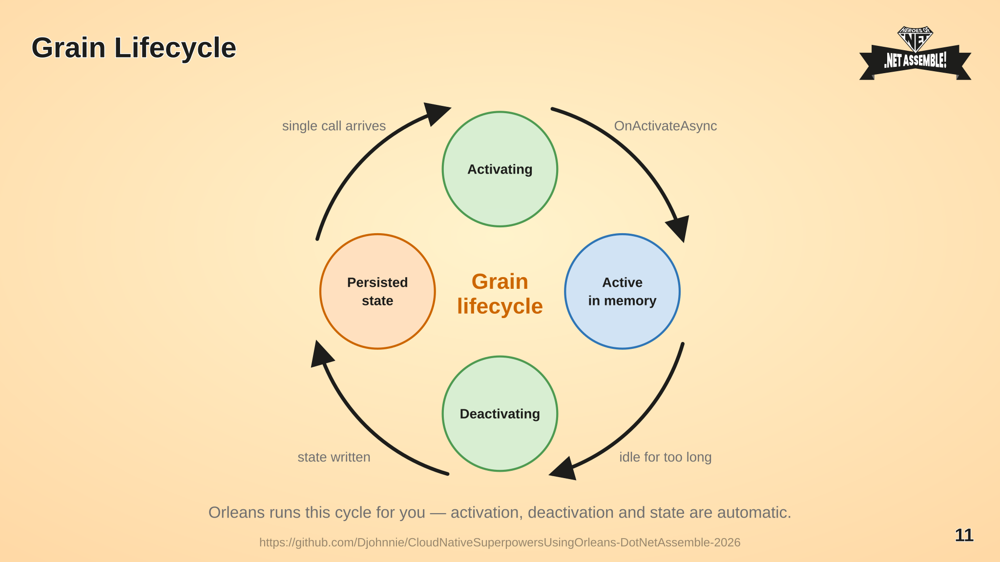

> **TL;DR:** We are following a grain through activation, active use, deactivation and persistence.

This part walks through the cycle the runtime manages on your behalf. A call arrives, Orleans activates the grain and runs `OnActivateAsync`, the grain serves calls from memory, and once it stays idle long enough it is deactivated and its state is written back to storage, ready to be activated again later.

### Slide 12 - Identity, Behaviour and State
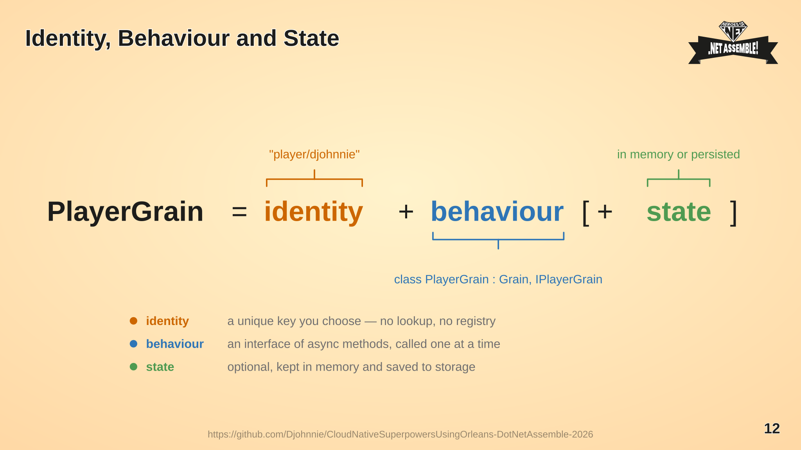

> **TL;DR:** You are learning that a grain is nothing more than an identity, some behaviour, and optionally state.

This slide breaks a grain down into its three ingredients. The identity is a key you choose yourself, such as `player/djohnnie`, so there is no registry or lookup. The behaviour is an interface of asynchronous methods implemented by a `Grain` class, executed one call at a time. State is optional and can live purely in memory or be persisted to storage.

### Slide 13 - Hosts and Silos
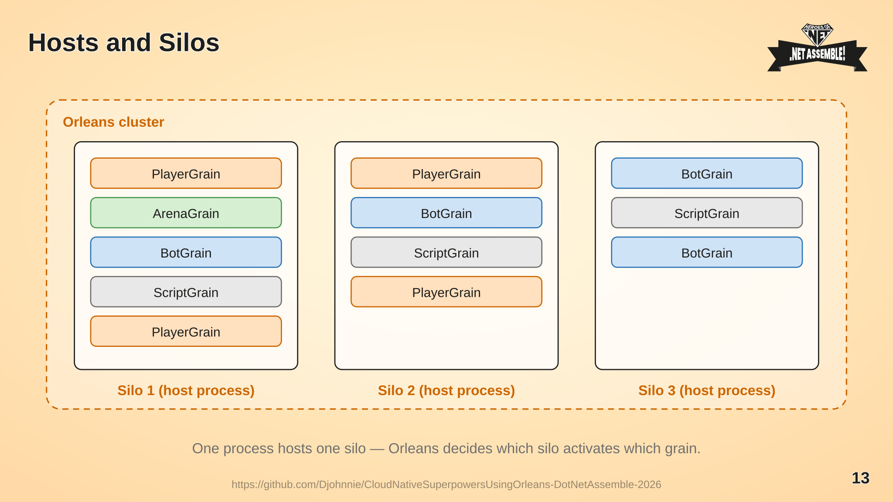

> **TL;DR:** We are seeing how grains are spread across silos, and how the cluster hides that from you.

This part shows where grains actually run. Each host process runs a silo, and silos together form a cluster. Orleans decides which silo activates which grain, so adding or losing a host simply changes the placement, not the way you write or call your code.

### Slide 14 - Single-Threaded Grains
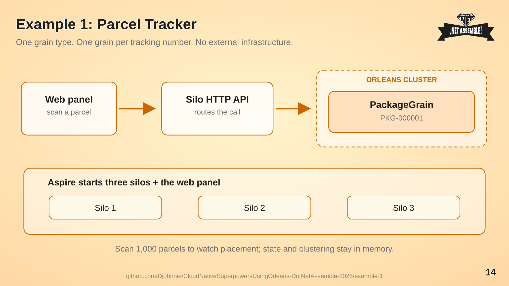

> **TL;DR:** You are learning that a grain only ever runs one call at a time, so you never write locks.

This part explains the concurrency guarantee of the runtime. Calls from many callers queue up in front of a grain, and the grain executes them one by one, never on more than one thread at a time. Combined with the isolation between grains, that means no shared data to protect, no locks and no synchronization, which is what makes distributed applications tractable even without deep expertise.

### Slide 15 - Example 1: Parcel Tracker
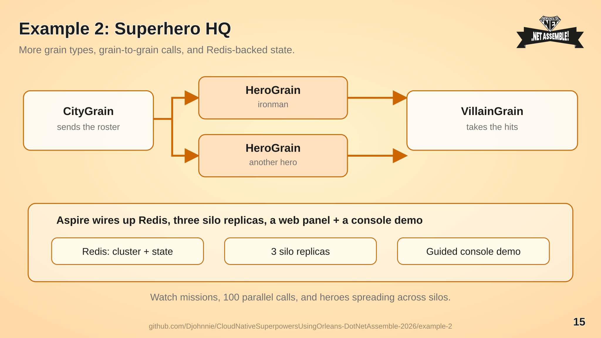

> **TL;DR:** You are following one parcel grain across three silos with no infrastructure to install.

One `PackageGrain` per tracking number keeps scan history and status in memory. Use the web panel to scan parcels, watch Orleans route requests across three silos, and inspect activations in the dashboard. Run the [Parcel Tracker example](example-1/README.md) with `dotnet run --project src/ParcelTracker.AppHost` from `example-1/`.

### Slide 16 - Example 2: Superhero HQ
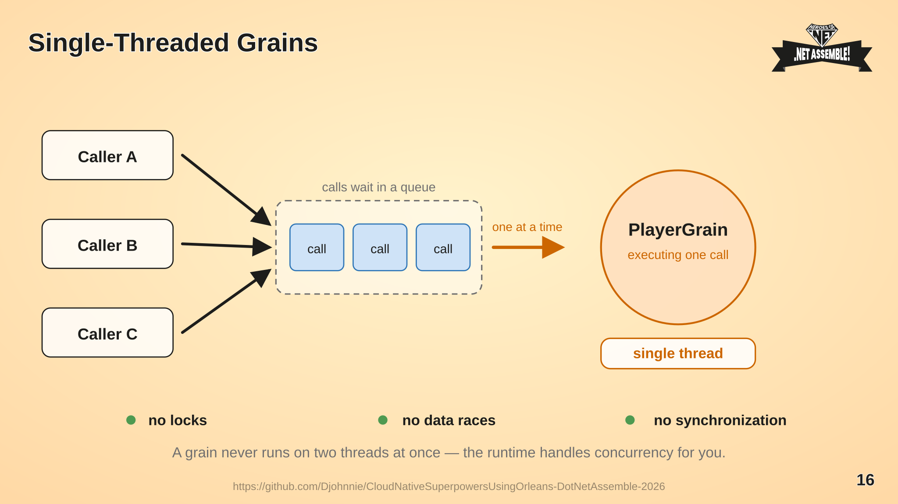

> **TL;DR:** We are adding grain-to-grain calls and Redis-backed clustering and state.

A `CityGrain` sends its heroes on a mission against a `VillainGrain`; hero and villain identities keep their own state. Aspire starts Redis and three silo replicas, with a web panel and a guided console demo you start on demand to watch missions, parallel calls and placement. Run [Superhero HQ](example-2/README.md) with `dotnet run --project src/SuperheroHQ.AppHost` from `example-2/`.

### Slide 17 - Example 3: Mijn Copilot
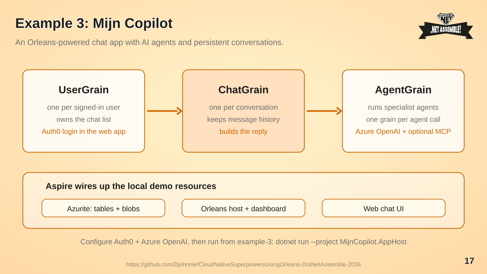

> **TL;DR:** You are seeing Orleans grains power a multi-agent chat app with durable conversations.

A `UserGrain` manages a user's chats, each `ChatGrain` holds conversation history, and short-lived `AgentGrain` instances run AI agents. Aspire starts the web app, Orleans host and Azurite for Azure Table clustering and blob-backed grain state. [Mijn Copilot](example-3/README.md) also needs Auth0 and Azure OpenAI configuration before you run `dotnet run --project MijnCopilot.AppHost` from `example-3/`.

### Slide 18 - Heterogeneous Silos
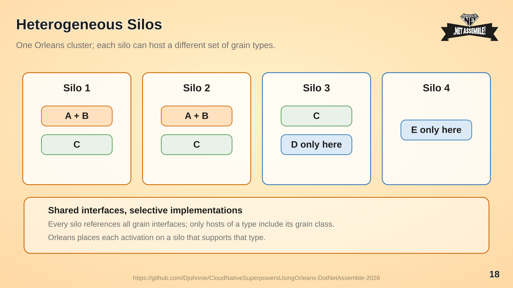

> **TL;DR:** You are learning that different silos in one cluster can host different grain types.

Grain types A and B can run on silos 1 and 2, C on silos 1–3, D only on silo 3, and E only on silo 4. All silos reference the shared grain interfaces, but only hosts that support a type include its implementation; Orleans places activations accordingly. A supported grain type must have the same implementation on every silo that hosts it. See the [Orleans heterogeneous silos documentation](https://learn.microsoft.com/en-us/dotnet/orleans/host/heterogeneous-silos) for configuration details and limitations.

### Slide 19 - Thank you! Any questions?
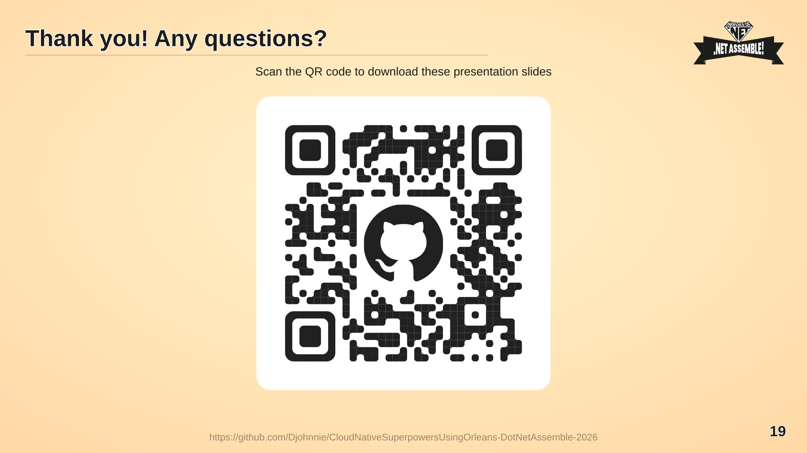

> **TL;DR:** We are wrapping up with time for your questions.

This closing slide gives you a final opportunity to ask questions about Orleans, the examples, or anything covered in the session.

## Examples

### Example 1 - Parcel Tracker

The dead-simple starting point: **one** grain type, `IPackageGrain`, with one instance per tracking number. No database, no containers, no grain-to-grain calls - clustering and grain state are both in memory. Orchestrated with .NET Aspire, driven from a small web control panel, and watched through the official Orleans Dashboard while the cluster scales to three silos. See [example-1/README.md](example-1/README.md).

### Example 2 - Superhero HQ

A runnable Orleans 10 application that demonstrates grains, silos, placement and the single-threaded execution model, orchestrated with .NET Aspire and including the official Orleans Dashboard. See [example-2/README.md](example-2/README.md).

### Example 3 - Mijn Copilot

An Orleans-powered chat app with persistent user and chat grains and short-lived AI agent grains. Aspire starts Azurite, the Orleans host and the web app; Auth0 and Azure OpenAI credentials are required to use the demo. See [example-3/README.md](example-3/README.md).